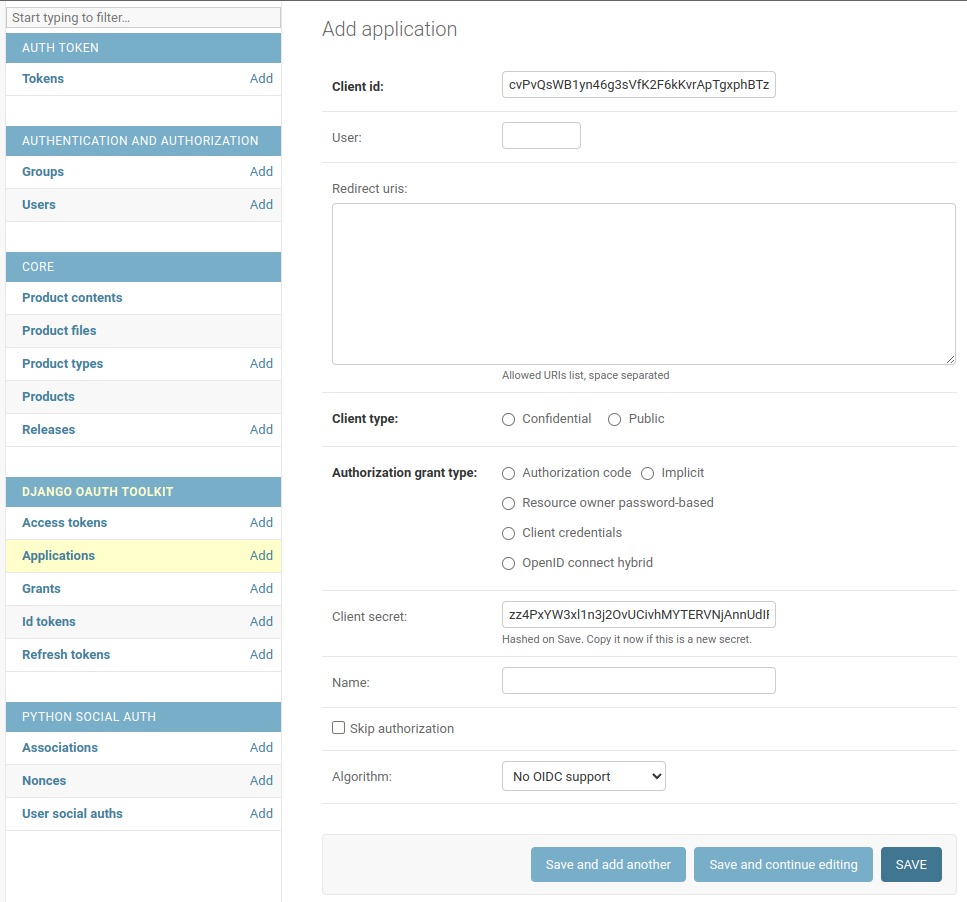

# Photo-z Server

[](https://github.com/linea-it/pzserver_app/actions/workflows/test.yml)
[](https://codecov.io/github/linea-it/pzserver_app)

The Photo-z Server is an online service based on software developed and delivered as part of the in-kind contribution program BRA-LIN, from LIneA to the Rubin Observatory's LSST. An overview of this and other contributions is available [here](https://linea-it.github.io/pz-lsst-inkind-doc/). The Photo-z Server design document is available [here](https://docs.google.com/document/d/1ZT-7dyA0ipWoRL4lViJLjuLE9uWgcSyNnuyZllsfGLQ/edit?usp=sharing).

## Setup Development Environment

Clone the repository and access the directory:

```bash
git clone https://github.com/linea-it/pzserver_app.git  
cd pzserver_app
```

Copy the file `docker-compose-development.yml` and rename to `docker-compose.yml`

```bash
cp docker-compose-development.yml docker-compose.yml
```

Create the environment variables file based on `env_template`.

```bash
cp env_template .env
cp .env.local-template .env.local
```

Edit the files and change the variables according to your environment, in this first moment pay attention to the variables referring to the django database and connection (optional).

Check your linux user id with: 

```bash
echo $UID
```
and update it in the `docker-compose.yml` file if necessary (if it is not the usual 1000). 

Now start the database service. It is important that the first time the database service is turned on alone, in this step postgresql will create the database and the user based on the settings `POSTGRES_USER`, `POSTGRES_PASSWORD` and `POSTGRES_DB`.

```bash
docker compose up database
```

Wait for the message `database system is ready to accept connections` and then close the service with the `CTRL + C` keys or `docker compose stop database` in another terminal.

Now start the backend service. As this is the first time, the base image will be pulled and the container will be built, this may take a while.

```bash
docker compose up backend
```
If everything goes normally the last message will be something like `... spawned uWSGI worker x (pid: xx, cores: x)`
 
Shut down the backend service to change one of the Django variables.

To terminate use `CTRL + C` or `docker compose stop`.

With the services turned off, let's run a command in the backend container to generate a SECRET for Django.

```bash
docker compose run backend python -c "import secrets; print(secrets.token_urlsafe())"
```

This is the output of the command:

```bash
$ docker compose run backend python -c "import secrets; print(secrets.token_urlsafe())"
Creating pzserver_backend_run ... done
6klbHhaeA6J2imKt9AVVgS5yl9mCWoiQqrfUV469DLA
```

Copy the generated key and replace the `SECRET` variable value in the `.env` file.

Create the Django superuser.

```bash
docker compose run backend python manage.py createsuperuser
```

Import the application's initial data using the following command:

```bash
docker compose run backend python manage.py loaddata initial_data
```

This `loaddata` command will insert some basic records into the database for the application to work. these records are in the `core/fixtures/initial_data.yaml` file.

Now install the Frontend dependencies by running the `yarn` command. As this is the first time starting this container, the base image will be pulled, which may take a while.

```bash
docker compose run frontend yarn
```

This command will create the directory `pzserver/frontend/node_modules` if you have any problem with dependencies remove this directory and run the command again.

In the development environment it is not necessary to change Ngnix settings.
But if a local change is needed, copy the `nginx_development.conf` file to `nginx.conf`
Also change the `docker-compose.yml` file in the ngnix service at the line `- ./nginx_development.conf:/etc/nginx/conf.d/default.conf:ro`. In this way, the ngnix.conf file represents your local environment, if you make any modifications that are necessary for the project, copy this modification to the template file, as the nginx.conf file is not part of the repository.

Finally, to start the whole application:

``` bash
docker compose up
```

### Setting Up a New Application to manage authentication

Go to Django ADMIN (for local installation, open a web browser and go to the URL: http://localhost/admin) and add a new Application with the following configuration:

- `client_id` and `client_secret` should be left unchanged (copy these two tokens and paste them as the values for variables `DJANGO_OAUTH_CLIENT_ID` and `DJANGO_OAUTH_CLIENT_SECRET` inside **.env** and **.env.local**). 
- `user` should be your superuser numeric ID (if you are the only user, it should be = 1)
- `redirect_uris` should be left blank
- `client_type` should be set to confidential
- `authorization_grant_type` should be set to **'Resource owner password-based'**
- `name` can be set to whatever you'd like
- checkbox for `Skip authorization` should remain unchecked
- `Algorithm`: keep the default option (No OIDC support)

> **WARNING**: As mentioned above, **BEFORE** clicking on the SAVE button, you must edit the configuration files (**.env** and **.env.local**) and change the variables `DJANGO_OAUTH_CLIENT_ID` and `DJANGO_OAUTH_CLIENT_SECRET` in both files according to the values of `client_id` and `client_secret` respectively. only after editing the configuration files, the `SAVE` button must be pressed.



The installation is done. To test the newly configured application, restart the service by pressing `Ctrl+C` in the terminal, then execute:  

```
docker compose up -d 
```

And then, go to `https://localhost` to open the application.   


### Orchestration setup

The Pz Server uses [orchestration](https://github.com/linea-it/orchestration/) to process its pipelines and for this you need to configure it:

``` bash
mkdir orchestration/db orchestration/logs orchestration/processes
```

``` bash
cp docker-compose-development-orch.yml docker-compose.yml
docker network create orchestration-network  # create internal network
```

Loading pipelines (submodules):

``` bash
git submodule init
git submodule update
```

Enter the orchestration-api container:
``` bash
docker compose run orchestration-api bash
```

Inside the container, create the database and an admin user:
``` bash
python manage.py migrate
python manage.py createsuperuser
```

Still inside the container, installing pipelines (confirm default directories with 'yes'):
``` bash
cd /pipelines
./setup.sh
```

Exit the container and start orchestration services:
``` bash
docker compose up orchestrator
```

And then follow the steps to create an authentication application ([step by step](https://github.com/linea-it/orchestration/?tab=readme-ov-file#how-to-use-using-client-credential)) just by changing the url from http://localhost to http://localhost:8088, and using the admin user created previously. Note when creating an authentication application, we must change the `ORCHEST_CLIENT_ID` and `ORCHEST_CLIENT_SECRET` in the `.env` with the client_id and secret_id values ​​respectively.

All that remains is to modify the ORCHEST_URL variable in the `.env` with the value http://orchestrator
``` bash
ORCHEST_URL=http://orchestrator
```

### Some example commands

Turn on background environment (if you have the application already running on the terminal, stop it with `CTRL + C` keys and up ir again, but in the background using `-d` argument):


```bash
docker compose up -d
```

Access in the browser:
    - Frontend: <http://localhost/>
    - Django Admin: <http://localhost/admin/>
    - Django REST: <http://localhost/api>

Turn off all environment:

```bash
docker compose stop
```

Restart all environment:

```bash
docker compose stop && docker compose up -d
```

Run a terminate on one of the services

```bash
# with the service turned on
docker compose exec backend bash
# with the service turned off
docker compose run backend bash
```

Access database with psql:

```bash
# Use the credentials that are in the .env
docker compose exec database psql -h localhost -U <username> -d <database>
```

Add libraries to frontend using yarn:

``` bash
docker compose run frontend yarn add <library>
```

Check front-end changes before pushing new commits to the remote repository (it is recommended to build the frontend to prevent errors with ESlint from disrupting the Pull Request process):

``` bash
docker compose run frontend yarn build
```

### Manual build of images and push to docker hub

Docker Hub: <https://hub.docker.com/repository/docker/linea/pzserver/>

The project is concentrated in just the `linea/pzserver` repository in the docker hub and the images are divided into two tags, one for the backend (**:backend_[version]**) and another for the frontend (**:frontend_[version ]**). The unique identification of each tag can be the version number example: `linea/pzserver:backend_v0.1` or the hash of the commit for development versions: `linea/pzserver:backend_8816330` to obtain the hash of the commit use the command `$(git describe --always)`.

> **WARNING**: Always build both images using the same version or same commit hash, even if one of the images has not been changed.

```bash
# Backend
cd pzserver/backend
docker build -t linea/pzserver:backend_$(git describe --always) .
# for the push, copy the image name that appears at the end of the build and do the docker push
docker push linea/pzserver:backend_<commit_hash>

# Frontend
cd pzserver/frontend
docker build -t linea/pzserver:frontend_$(git describe --always) .
# for the push, copy the image name that appears at the end of the build and do the docker push
docker push linea/pzserver:frontend_<commit_hash>
```

### Run backend unit tests

run all tests

```bash
docker compose exec backend pytest
```

run all tests with coverage, Check local coverage in localhost/coverage

```bash
docker compose exec backend pytest --cov=./ --cov-report=html
```

run only a file

```bash
docker compose exec backend pytest core/test/test_product_file.py
```

run only a class

```bash
docker compose exec backend pytest core/test/test_product_file.py::ProductFileListCreateAPIViewTestCase
```

run single test method

```bash
docker compose exec backend pytest core/test/test_product_file.py::ProductFileListCreateAPIViewTestCase::test_list_product_file
```

## Enable authentication via LIneA Satosa (Github)

### Keys and certificates

Edit the `.env` to include the path to the certificates for signing and encrypting SAML assertions:
(It is possible to use the same certificate for both signing and encryption.)

```bash
# Keys and certificates
SIG_KEY_PEM=<your-key-path>
SIG_CERT_PEM=<your-certificate-path>
ENCRYP_KEY_PEM=<your-key-path>
ENCRYP_CERT_PEM=<your-certificate-path>
```

If you do not have valid certificates (not recommended in production), generate a self-signed certificate using the command below:

Create the `certificates` directory with the following command:

```bash
mkdir -p saml2/certificates 

openssl genrsa -out pz.key 2048
openssl req -new -key pz.key -out pz.csr
openssl x509 -req -days 365 -in pz.csr -signkey pz.key -out pz.crt

cp pz.key pzkey.pem
cp pz.crt pzcert.pem
```

Next we must uncomment the volume that represents the saml2 directory in docker-compose.yml:

```yml
- ./archive/log/backend:/archive/log
- ./archive/data:/archive/data
- ./saml2:/saml2  # uncomment if authentication with github is required
```

### IDP Metadata (Github)

Edit the `.env` and tell where the metadata can be found:
(Contact the infrastructure team to find out more details about the metadata.)

```bash
# IDP metadata
IDP_METADATA=<Github-metadata-path>
```

And finally, just uncomment the `AUTH_SHIB_URL` variable in the `.env`:

```bash
# Saml2 / Satosa Auth
# URL to login using satosa
AUTH_SHIB_URL=${URI}/saml2/login/
```

With everything configured and the services started, we must access the URL `${URI}/saml2/metadata/` and send the content (xml) to the infrastructure team to create a trust relationship between the application and satosa.

## Setup Production Enviroment

In the production environment **NO** it is necessary to clone the repository.

The following example assumes an installation where the database and ngnix are in containers as in the dev environment and the volumes are directories within the pzserver root.

Only:

- create the folders
- create `docker-compose.yml` file
- create `.env` file
- create `ngnix.conf` file

Create the `pzserver` and `archive` directories

```bash
mkdir pzserver pzserver/archive pzserver/archive/data pzserver/archive/django_static
cd pzserver
```

Create a `docker-compose.yml` file based on the `docker-compose-production.yml` template

Change the frontend and backend images to the desired version, replace the string `<VERSION>` with the image tag.

Change the port that will be used for the application, replace the string `<PORT>` by a port that is available in the environment, this port should be associated with the application's url.

Edit the file as per your environment needs.
Usually the changes are in ngnix volumes and port.

Create an `.env` file based on the `env_template` file and edit the database access variables.

Wait for the message `database system is ready to accept connections` and then close the service with the `CTRL + C` keys or `docker compose stop database` in another terminal.

```bash
docker compose up database
```

Start the backend service and wait for the `Booting worker with pid...` message.

```bash
docker compose up backend
```

Shutdown the backend service and change the Django variables.
Edit the `.env` file

In production it is **MANDATORY** to turn off Debug `DEBUG=0`. and change the `SECRET` variable which must be unique for each environment.

With the service turned off, run the command below to generate a SECRET, copy and paste it into the `.env`

```bash
docker compose run backend python -c "import secrets; print(secrets.token_urlsafe())"
```

```bash
docker compose run backend python manage.py createsuperuser
```

Create the Ngnix configuration file `nginx.conf` based on the `nginx_production.conf` file

Start all services

```bash
docker compose up -d
```

Configure a URL that points to the machine where it is installed on the port configured for Ngnix in docker-compose.

At the end of this example the pzserver folder looks like this:

```bash
-rw-r--r-- docker-compose.yml
-rw-r--r-- nginx.conf # Ngnix configuration file.
-rw-r--r-- .env # File with configuration variables
drwxr-xr-x archive # Directory where the files generated by the application are kept.
drwx------ pg_data # Directory where postgresql files are in container
drwxr-xr-x pg_backups # Directory where postgresql files are in container
```

## Update Production Enviroment

Procedure to update the production environment or any other that uses built images.

- Edit the `docker-compose.yml` file and change the frontend and backend images tag.
- Edit the `.env` file to add new variables or change them if necessary.
- Pull the new images with the `docker compose pull` command.
- Restart services `docker compose stop && docker compose up -d`.

